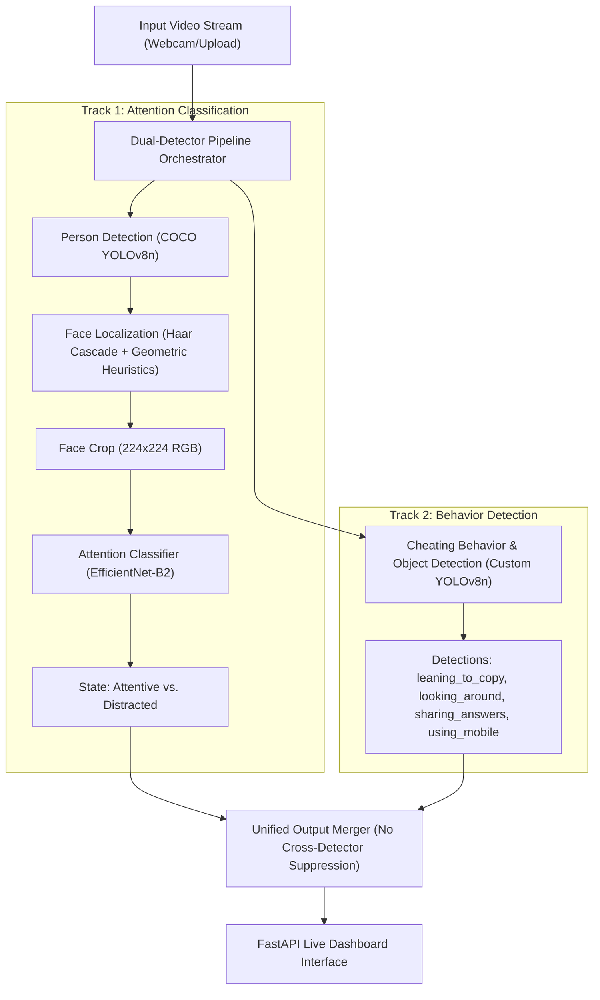

# CogniVision: Automated Student Attention and Cheating Behavior Detection

CogniVision is an AI-powered computer vision system designed for live student monitoring in educational environments (exams, remote proctoring, and hybrid classrooms). By combining a high-accuracy, fine-tuned **EfficientNet-B2** attention classifier with a custom-trained **YOLOv8** object and behavior detector, the system provides real-time alerts and visual metrics through an interactive FastAPI dashboard.

---

## 👁️ System Overview & Core Workflow

CogniVision operates a **multi-track, dual-detector pipeline** that processes live frames concurrently without cross-detector suppression to ensure that critical objects (such as mobile phones) are not masked or suppressed by student bounding boxes.

### 1. Unified System Pipeline


---

## 🚀 Key Features

*   **Real-Time Dashboard**: High-fidelity web dashboard featuring live video overlays with visual risk cues.
*   **Tactile 2.5D Metric Cards**: Interactive dashboard status panels utilizing dynamic drop-shadows and glassmorphism styling to visualize classroom focus score.
*   **Dual-Detector Integration**: Parallel execution of Person Classification and Custom Object Detection to mitigate false negatives.
*   **Modular Pipeline**: Fully decoupled inference engines allowing retraining or model replacement independent of API logic.
*   **Robust Fallbacks**: Grayscale-based attention estimation heuristics that execute automatically if neural network weights fail to initialize.

---

## 📊 Model Training & Evaluation Workflow

The two primary visual tracks were trained independently on specific datasets to maximize accuracy and minimize run-time latency:

```mermaid
graph TD
    subgraph TrackA["Attention Track Workflow"]
        A1["FER2013 Facial Dataset"] --> A2["Map to Binary Attention Labels"]
        A2 --> A3["Augmentation (Flips, Rotation, Jitter)"]
        A3 --> A4["EfficientNet-B2 Compound Scaling"]
        A4 --> A5["Evaluation & Validation"]
        A5 --> A6["Save attention_model.pth (90.10% Val Acc)"]
    end

    subgraph TrackB["Behavior Track Workflow"]
        B1["656 Custom Annotated Images"] --> B2["YOLO Bounding Box Labels"]
        B2 --> B3["YOLOv8n Transfer Learning (100 Epochs)"]
        B3 --> B4["mAP@0.5 Performance Tuning"]
        B4 --> B5["Save yolov8n.pt (37.3% mAP@0.5)"]
    end
```



### Performance Summary
*   **Attention Classifier (EfficientNet-B2)**: 
    *   **Validation Accuracy**: `90.10%`
    *   **Test Accuracy**: `89.05%`
    *   **Precision / Recall / F1-Score**: `89.2% / 88.8% / 0.890`
*   **Behavior Detector (YOLOv8n)**:
    *   **mAP@0.5**: `37.3%`
    *   **Classes**: `leaning_to_copy`, `looking_around`, `sharing_answers`, `using_mobile`

---

## 📂 Project Structure

```text
cognivision/
├── config.yaml                # Centralized configuration (thresholds, paths)
├── Dockerfile                 # Containerization setup
├── docker-compose.yml         # Local orchestration file
├── requirements.txt           # Python dependencies
├── README.md                  # Comprehensive project overview
├── context.md                 # Detailed model details & hyperparameters
├── COGNIVISION_PROJECT_REPORT.md  # Official evaluation report
├── yolov8n.pt                 # YOLOv8 nano model weights
├── data/                      # Test frames, local clips, and exports
├── logs/                      # System logging outputs
├── tests/                     # Verification test suites
│   ├── __init__.py
│   └── test_core.py
└── src/                       # Application Source Code
    ├── __init__.py
    ├── cli.py                 # Command line controller
    ├── config.py              # YAML config parsing logic
    ├── logging_setup.py       # Custom log formatting
    ├── main.py                # Main offline inference runner
    ├── api/                   # FastAPI Web Server & UI Assets
    │   ├── __init__.py
    │   ├── app.py             # Server endpoints & routing
    │   ├── main.py            # API entrypoint
    │   ├── index.html         # Premium dashboard interface
    │   ├── static/            # Frontend CSS/JS visual assets
    │   └── templates/         # HTML template layouts
    ├── core/                  # Inference Engines
    │   ├── __init__.py
    │   ├── classifier.py      # Abstract classification wrappers
    │   ├── detector.py        # Generic object detection module
    │   ├── efficientnet_classifier.py  # Attention classification engine
    │   ├── engine.py          # Unified model runner
    │   ├── pipeline.py        # Suppression-free merging pipeline
    │   └── scorer.py          # Real-time attention scores aggregator
    ├── models/                # Trained model weights & PyTorch files
    │   ├── attention_classifier.py     # EfficientNet model definition
    │   ├── attention_model.pth         # Classifier weights (~11.7 MB)
    │   ├── detector.py                 # YOLO detector wrapper
    │   └── train_classifier.py         # Local classifier training script
    ├── training/              # Retraining Workflows
    │   ├── __init__.py
    │   ├── fer2013_dataset.py          # PyTorch attention data loaders
    │   ├── train.py                    # Local training loop controller
    │   └── train_efficientnet_kaggle.py # Cloud notebook training scripts
    └── utils/                 # Utilities
        └── capture_webcam.py           # Multi-threaded webcam reader
```

---

## 🛠️ Setup & Execution

### 1. Prerequisites
Ensure you have **Python 3.8+** installed.

### 2. Local Environment Setup
```bash
# Clone the repository
git clone https://github.com/Khubaib7-del/Cognivision.git
cd Cognivision

# Install required dependencies
pip install -r requirements.txt
```

### 3. Launching the Web Dashboard
Start the FastAPI server by running:
```bash
python -m uvicorn src.api.main:app --host 127.0.0.1 --port 8000
```
Open your web browser and navigate to **`http://127.0.0.1:8000`** to view the live dashboard.

---

## ⚠️ Notes & Exclusions

*   **Large Weights**: The large pre-trained and custom-trained model checkpoints (e.g. standard YOLO weights) are omitted from GitHub tracking. Download or move custom weights into `src/models/` before initiating full validation checks.
*   **Evaluation Mode**: The system is tuned to prioritize **Recall** (`confidence: 0.25`) rather than aggressive filtering. This ensures maximum safety in proctoring scenarios where missing an action (false negative) is much more costly than checking an auxiliary box.